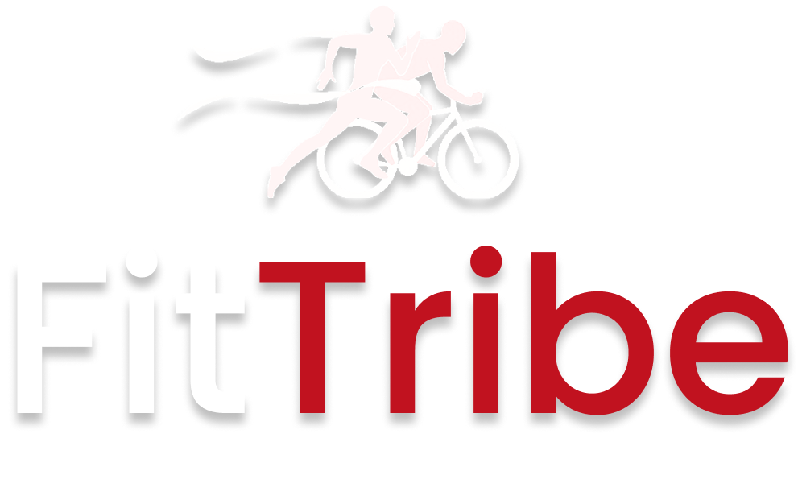
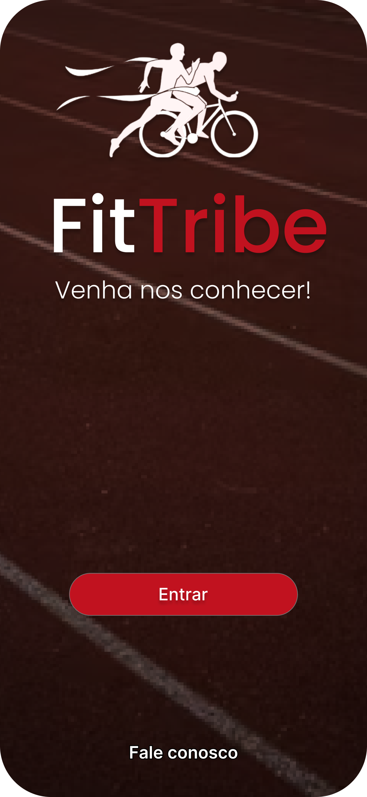

# <p align="center">FitTribe - Aplicativo Mobile para Eventos Esportivos</p>

<p align="center">
  
</p>

---

## ✨ Visão Geral

O **FitTribe** é um aplicativo mobile moderno, desenvolvido para facilitar a **organização e participação em eventos esportivos**, com foco em modalidades como corrida e ciclismo. A proposta é conectar atletas, amadores e organizadores em uma plataforma acessível, segura e visualmente atraente.

Nosso objetivo é promover um ambiente digital onde os usuários possam **descobrir eventos**, se **inscrever com facilidade**, **interagir com outros participantes** e **acompanhar suas conquistas esportivas**.

---

## 🚀 Funcionalidades já implementadas

| Módulo                 | Descrição                                                | Status            |
|------------------------|------------------------------------------------------------|-------------------|
| **Boas-vindas**        | Tela inicial com visual moderno e mensagem de entrada     | ✔️ Concluído       |
| **Autenticação**       | Login com botão de contato e autenticação básica          | ✔️ Concluído       |
| **Mapa Interativo**    | Visualização geográfica dos eventos                       | ✔️ Concluído       |
| **Lista de Eventos**   | Listagem de eventos com título, data e local              | ✔️ Concluído       |
| **Detalhes do Evento** | Informações detalhadas de cada evento                     | ✔️ Concluído       |
| **Navegação**          | Transições fluídas entre telas                            | ✔️ Concluído       |

### 🔜 Próximas funcionalidades:
- Inscrição e confirmação em eventos  
- Filtro por modalidade e distância  
- Histórico de participação  
- Chat entre participantes  
- Perfil do usuário com estatísticas

---

## 📸 Telas principais

| Boas-vindas | Login |
|------------|--------|
|  |  |

> Veja todas as telas no [Figma do projeto](https://www.figma.com/design/ABWPo8MZ19mHZetOu6WeUq/P.I?node-id=2069-11&t=gIiNGELolFAaCJUS-1)

---

## 📱 Tecnologias Utilizadas

| 🚀 Tecnologia       | 🚀 Tecnologia         | 🚀 Tecnologia          |
|---------------------|-----------------------|------------------------|
| ⚛️ React Native     | 🔥 Firebase Auth       | 🔥 Firebase Firestore  |
| 📱 Expo             | 🗺️ Mapbox              | 🖥️ Node.js             |
| 🎨 Styled Components| 🧪 React Navigation   | 🌐 Git/GitHub           |

---

## 👥 Equipe de Desenvolvimento

<table align="center">
  <tr>
    <td align="center">
      <a href="https://github.com/carloseduardo-rocha">
        <br />
        <sub><b>Carlos Eduardo</b></sub>
      </a>
    </td>
    <td align="center">
      <a href="https://github.com/ArtLevy">
        <br />
        <sub><b>Art Levy</b></sub>
      </a>
    </td>
    <td align="center">
      <a href="https://github.com/CarlosLevyM">
        <br />
        <sub><b>Carlos Levy</b></sub>
      </a>
    </td>
    <td align="center">
      <a href="https://github.com/oliveriraneto">
        <br />
        <sub><b>Neto Oliveira</b></sub>
      </a>
    </td>
    <td align="center">
      <a href="https://github.com/UlissesBernardo">
        <br />
        <sub><b>Ulisses Bernardo</b></sub>
      </a>
    </td>
  </tr>
</table>

---

## 💻 Como rodar o projeto

```bash
# Clone o repositório
git clone https://github.com/carloseduardo-rocha/FitTribe-App_Mobile

# Acesse o diretório
cd FitTribe-App_Mobile

# Instale as dependências
npm install

# Inicie o projeto
npx expo start
